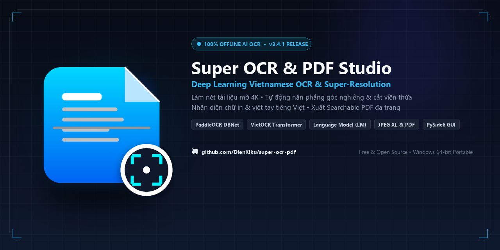

<div align="center">



# 🚀 Super OCR & High-Res PDF Studio (v3.5.1)

[](https://github.com/DienKiku/super-ocr-pdf/releases)
[-0078d7?style=for-the-badge&logo=windows)](https://github.com/DienKiku/super-ocr-pdf)
[](https://www.python.org/)
[](https://github.com/DienKiku/super-ocr-pdf)
[](https://github.com/DienKiku/super-ocr-pdf)

Ứng dụng Desktop chuyên nghiệp dành cho Windows: **Phục chế làm nét chữ siêu phân giải (Super-Resolution), nhận diện OCR Tiếng Việt & Chữ viết tay thông minh 100% Offline với cơ chế Nhận diện Kép (Dual-Engine Voting AI), hỗ trợ ảnh JPEG XL (JXL) dung lượng lớn và xuất tệp PDF chất lượng cao (Searchable PDF & High-Res Image PDF)**.

Phát triển bởi: **Fami (fami_7006)**  
Mã nguồn: [https://github.com/DienKiku/super-ocr-pdf](https://github.com/DienKiku/super-ocr-pdf)

</div>

---

## 🌟 Các tính năng nổi bật

### 1. 🔍 Phục chế & Làm nét chữ siêu phân giải
- **Tăng độ nét viền chữ (Text Sharpening):** Thuật toán kết hợp Unsharp Masking và bộ lọc cạnh chi tiết giúp khử nhòe mờ do rung tay hoặc chụp thiếu sáng, làm sắc nét từng nét thanh đậm của văn bản.
- **Siêu phân giải (Lanczos-4 Super-Resolution):** Phóng đại tài liệu 1.5x, 2x, 3x, 4x lên chuẩn in ấn sắc nét **300 - 600 DPI** mà không bị vỡ hạt hay răng cưa.
- **Tẩy trắng nền & Khử bóng (Background Whitening & Shadow Removal):** Tự động loại bỏ các vết bóng đổ do điện thoại hoặc tay cầm, khử ố vàng và làm sạch nền giấy như máy quét chuyên dụng.
- **Tăng tương phản thông minh (CLAHE):** Tự động cân bằng ánh sáng cục bộ, tăng độ tương phản của mực chữ mà không làm cháy sáng tài liệu.
- **Bộ cài đặt sẵn 1-click (Smart Presets):**
  - ⭐ **Văn bản siêu nét (Ultra Sharp):** Tối ưu hóa viền chữ cho tài liệu văn bản in và hợp đồng.
  - 📄 **Quét sạch nền & Khử bóng (Clean Scan):** Làm trắng phông nền, khử bóng tối ưu hóa in ấn.
  - 🖨️ **Đen trắng chuẩn tài liệu (Crisp B&W):** Nhị phân hóa thích ứng tạo bản scan đen trắng rõ nét.
  - 🔍 **Phóng to siêu phân giải (Super Res 3x):** Phóng đại độ phân giải ảnh lên mức cực cao.
  - 🖼️ **Màu gốc tự nhiên (Natural Color):** Giữ nguyên màu sắc trung thực ban đầu của tài liệu.

### 2. ⚡ Thanh trượt so sánh Trước / Sau thời gian thực (Split Slider Preview)
- Kéo thanh trượt trực tiếp trên trang tài liệu để trực quan hóa sự khác biệt giữa **Ảnh gốc (Trước)** và **Ảnh đã phục chế làm nét (Sau)**.
- Hỗ trợ phóng to/thu nhỏ (Zoom in/out), xem theo tỷ lệ chuẩn 100% (1:1), vừa khít khung nhìn (Fit to window) và di chuyển tự do (Pan).

### 3. 📝 Hệ thống nhận diện AI Dual-Engine 100% Offline đột phá
- 🇻🇳 **Cơ chế Nhận diện Kép (Dual-Engine AI Voting & Fusion):**
  - **Tầng 1 (Định vị & Cắt ảnh thích ứng):** Mô hình **PaddleOCR DBNet (PP-OCRv4)** định vị khung chữ $1:1$, kết hợp giải thuật **Dynamic Adaptive Padding** (16% chiều cao dòng) bảo vệ $100\%$ dấu thanh và đuôi chữ.
  - **Tầng 2 (Phân tích bố cục đa cột XY-Cut):** Tự động phát hiện rãnh trắng (gutter) và tách cột độc lập, bảo toàn thứ tự đọc tự nhiên của tài liệu 2–3 cột.
  - **Tầng 3 (Nhận diện Kép Song Song):** Kết hợp tốc độ và độ chuẩn xác số hiệu của **PaddleOCR SVTR-LCNet v4** cùng khả năng hiểu tiếng Việt ngữ cảnh của **VietOCR ResNet/VGG Transformer**. Bộ trọng tài tự động phân xử và cross-validation kết quả.
  - **Tầng 4 (Mô hình Ngôn ngữ Bi-Gram LM):** Tra cứu từ điển 74.000 từ vựng và mạng lưới xác suất 48.000 cặp từ bi-gram, giải quyết triệt để các từ đa nghĩa bị mất dấu đồng thời bảo toàn 100% mã số thuế, email, website và ký hiệu kỹ thuật.

### 4. 🚀 Tối ưu hóa hiệu năng & Hỗ trợ chuẩn JPEG XL (JXL)
- **Hỗ trợ định dạng ảnh tiên tiến JPEG XL (`.jxl`):** Xử lý trực tiếp các kho ảnh nén chất lượng cao thế hệ mới.
- **Cơ chế nạp lười thông minh (Lazy Loading & Smart Pagination):** Đọc trơn tru thư mục chứa **5.000+ bức ảnh** chỉ với ~75MB RAM thay vì hàng chục GB, ngăn ngừa hoàn toàn hiện tượng tràn bộ nhớ hay treo ứng dụng.
- **Giao diện đáp ứng (Adaptive Responsive UI) & Khay hệ thống (System Tray):** Tự động căn chỉnh vừa vặn với mọi độ phân giải màn hình từ Laptop 1366x768 đến màn hình 4K; biểu tượng khay hệ thống giúp ứng dụng luôn sẵn sàng phục vụ.

### 5. 📄 Xuất PDF Siêu Phân Giải & Tìm kiếm được (Searchable PDF)
- **PDF Tìm kiếm được (Searchable PDF):** Tự động nhúng lớp chữ OCR ẩn chính xác từng tọa độ từ. Khi mở trên bất kỳ trình đọc PDF nào (Adobe Acrobat, Foxit Reader, Chrome, Edge), bạn có thể **tìm kiếm (Ctrl+F), bôi đen và sao chép (Copy) văn bản**.
- **PDF Ảnh siêu phân giải (High-Res Image PDF):** Giữ trọn độ nét cao nhất cho nhu cầu in ấn và lưu trữ hồ sơ.
- Đa dạng tùy chọn khổ trang: Khớp tỷ lệ ảnh gốc, Khổ A4 Dọc, Khổ A4 Ngang.
- Hỗ trợ xuất gộp toàn bộ các trang thành 1 tệp PDF duy nhất hoặc xuất tách từng tệp riêng lẻ.

---

## 🛠️ Hướng dẫn cài đặt & Chạy ứng dụng

### 1. Dành cho người dùng thông thường (Khuyên dùng - Không cần cài Python)
- Tải trực tiếp gói ứng dụng độc lập tại mục **[Releases](https://github.com/DienKiku/super-ocr-pdf/releases)**:
  - Tải tệp: **`SuperOCRPDFStudio_v3.5.1_Portable_Win64.zip`**
  - Giải nén tệp `.zip` vào bất kỳ thư mục nào trên máy tính.
  - Nhấp đúp chuột vào **`SuperOCRPDFStudio.exe`** để mở ứng dụng ngay lập tức (100% đầy đủ thư viện & mô hình AI, không cần cài đặt gì thêm).

### 2. Khởi chạy từ mã nguồn (Dành cho nhà phát triển)
#### Yêu cầu hệ thống:
- Hệ điều hành: Windows 10 / 11 (64-bit)
- Python 3.10 trở lên (khuyên dùng Python 3.11 hoặc 3.12)

#### Cách chạy:
```bash
# Clone mã nguồn về máy
git clone https://github.com/DienKiku/super-ocr-pdf.git
cd super-ocr-pdf

# Cài đặt các thư viện phụ thuộc
pip install -r requirements.txt

# Khởi chạy ứng dụng
python main.py
# HOẶC nhấp đúp vào file run.bat để khởi động
```

### 3. Tự đóng gói ra file `.EXE` độc lập
- Nhấp đúp chuột vào file **`build_exe.bat`** (yêu cầu máy đã cài Python và các thư viện).
- Sau khi đóng gói hoàn tất, ứng dụng sẽ nằm tại:
  ```text
  dist\SuperOCRPDFStudio\SuperOCRPDFStudio.exe
  dist\SuperOCRPDFStudio_v3.5.1_Portable_Win64.zip
  ```

---

## ⌨️ Phím tắt tiện lợi

| Phím tắt | Chức năng |
|:---|:---|
| `Ctrl + O` | Mở hộp thoại thêm hình ảnh / tài liệu |
| `F5` | Quét OCR cho trang đang xem |
| `F6` | Quét OCR hàng loạt cho toàn bộ các trang |
| `Ctrl + E` | Mở hộp thoại xuất file PDF siêu phân giải |
| `Cuộn chuột` | Phóng to / Thu nhỏ ảnh trong khung xem trước |
| `Kéo chuột giữa / Phải` | Di chuyển khung hình tự do (Pan) |

---

## 📂 Cấu trúc thư mục dự án

```text
super_ocr_pdf/
├── run.bat                     # File khởi động nhanh ứng dụng 1-click
├── build_exe.bat               # File script đóng gói ra file .EXE độc lập
├── sync_github.bat             # File script 1-click tự động đồng bộ code lên GitHub
├── requirements.txt            # Danh sách các thư viện Python yêu cầu
├── main.py                     # Điểm khởi chạy chính của ứng dụng
├── SuperOCRPDFStudio.spec      # Cấu hình đóng gói chuyên sâu PyInstaller
├── core/                       # Tầng xử lý logic nghiệp vụ và thuật toán AI
│   ├── config_manager.py       # Quản lý cấu hình người dùng và API Key
│   ├── enhancer.py             # Bộ thuật toán làm nét chữ, siêu phân giải, khử bóng
│   ├── ocr_engine.py           # Bộ nhận diện OCR (Hybrid AI & Google Gemini Vision)
│   ├── pdf_builder.py          # Bộ sinh file PDF (Searchable PDF & High-Res PDF)
│   └── models/                 # Từ điển tiếng Việt 74.000 từ & mô hình AI ONNX
└── ui/                         # Tầng giao diện người dùng (PySide6 GUI)
    ├── main_window.py          # Cửa sổ chính và điều phối tiến trình
    ├── image_list_widget.py    # Danh sách thumbnail các trang, xoay và sắp xếp
    ├── preview_widget.py       # Khung xem so sánh trước/sau (Split slider & Zoom/Pan)
    ├── settings_panel.py       # Bảng điều khiển bộ lọc làm nét và siêu phân giải
    ├── ocr_panel.py            # Bảng nhận diện OCR, chỉnh sửa văn bản, cấu hình API
    ├── export_dialog.py        # Hộp thoại xuất file PDF chất lượng cao
    └── styles.py               # Thiết kế giao diện Dark Mode hiện đại
```

---

## 📄 Bản quyền & Giấy phép

Phát triển bởi **Fami (fami_7006)**.  
Dự án được xây dựng phục vụ nhu cầu xử lý văn bản, phục chế chứng từ và số hóa tài liệu chất lượng cao.
